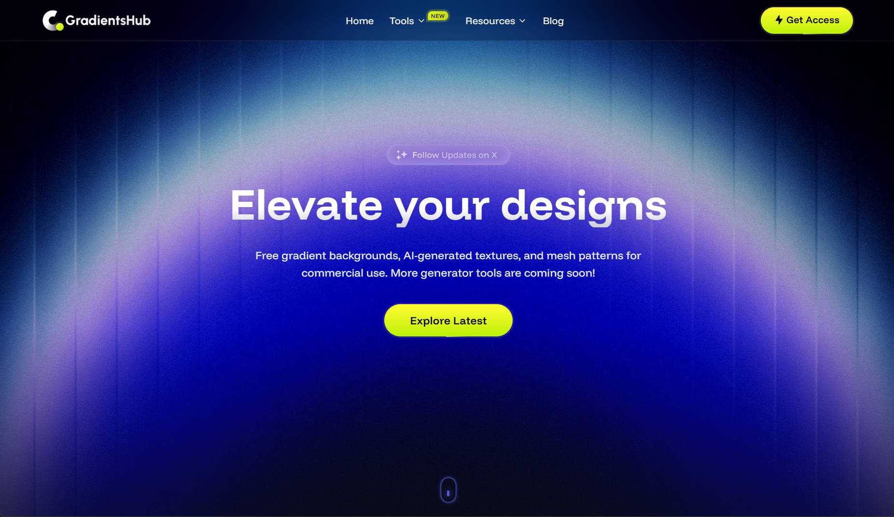
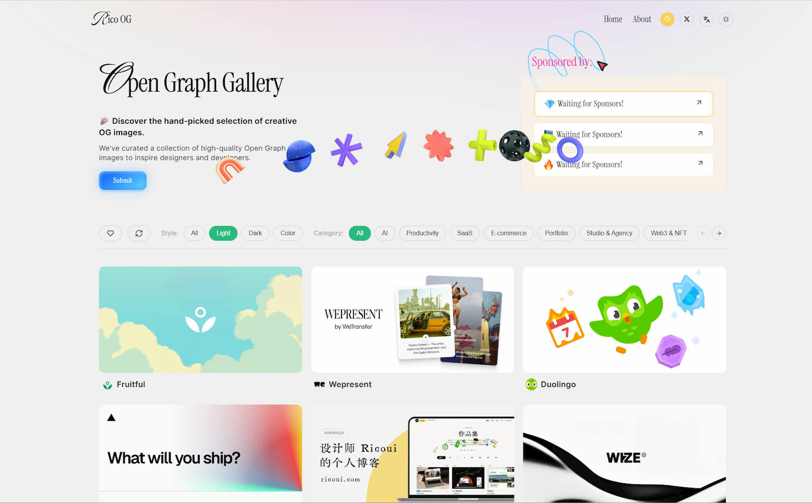
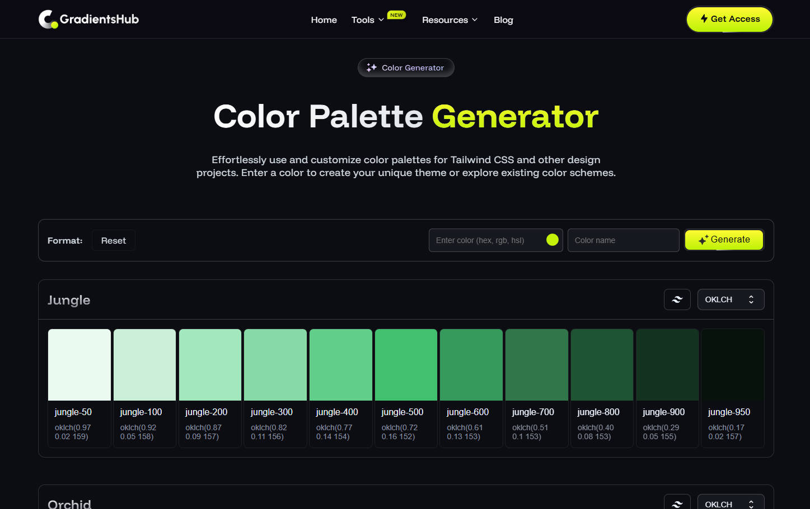
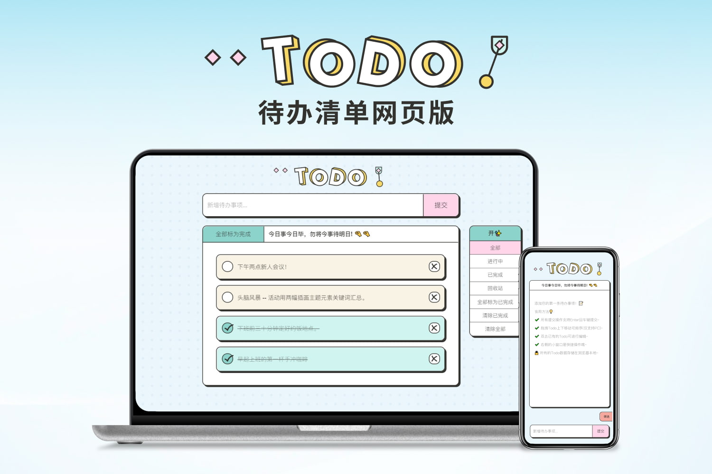
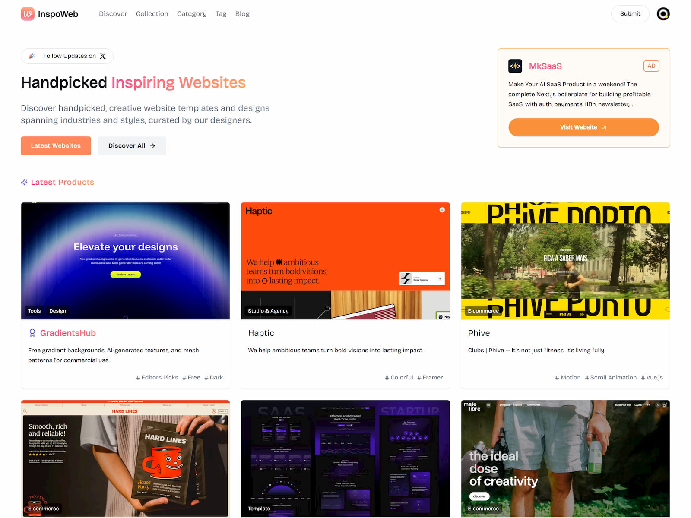
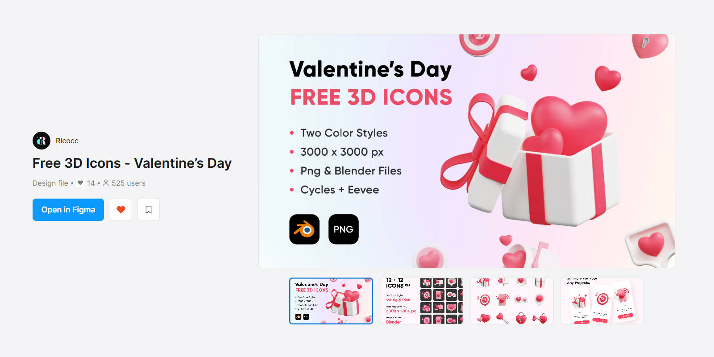

This test post demonstrates all the different MDX sections and formatting options available for blog posts. Lorem ipsum dolor sit amet, consectetur adipiscing elit. Sed do eiusmod tempor incididunt ut labore et dolore magna aliqua.

## Headings

### H3 - Third Level Heading

Lorem ipsum dolor sit amet, consectetur adipiscing elit. Ut enim ad minim veniam, quis nostrud exercitation ullamco laboris.

#### H4 - Fourth Level Heading

Duis aute irure dolor in reprehenderit in voluptate velit esse cillum dolore eu fugiat nulla pariatur.

##### H5 - Fifth Level Heading

Excepteur sint occaecat cupidatat non proident, sunt in culpa qui officia deserunt mollit anim id est laborum.

###### H6 - Sixth Level Heading

Sed ut perspiciatis unde omnis iste natus error sit voluptatem accusantium doloremque laudantium.

---

## Text Formatting

This paragraph contains **bold text**, *italic text*, and ***bold italic text***. You can also use ~~strikethrough~~ for deleted content.

Here's some `inline code` within a paragraph. Lorem ipsum dolor sit amet, consectetur adipiscing elit.

> This is a blockquote. Lorem ipsum dolor sit amet, consectetur adipiscing elit. Sed do eiusmod tempor incididunt ut labore et dolore magna aliqua. Ut enim ad minim veniam.

> **Nested blockquote with formatting**
>
> Lorem ipsum dolor sit amet, consectetur adipiscing elit.
>
> > This is a nested blockquote inside the first one.

---

## Links

- [External link to Google](https://google.com)
- [Internal link to homepage](/)
- Auto-linked URL: https://example.com

---

## Lists

### Unordered List

- First item lorem ipsum dolor sit amet
- Second item consectetur adipiscing elit
  - Nested item one
  - Nested item two
    - Deep nested item
- Third item sed do eiusmod tempor

### Ordered List

1. First step in the process
2. Second step with more details
   1. Sub-step one
   2. Sub-step two
3. Third step to complete

### Task List

- [x] Completed task item
- [x] Another completed task
- [ ] Pending task item
- [ ] Future task to complete

---

## Code Blocks

### JavaScript

```javascript
// Example JavaScript code
function greetUser(name) {
  const greeting = `Hello, ${name}!`;
  console.log(greeting);
  return greeting;
}

const users = ['Alice', 'Bob', 'Charlie'];
users.forEach(user => greetUser(user));
```

### TypeScript

```typescript
interface User {
  id: number;
  name: string;
  email: string;
  isActive: boolean;
}

async function fetchUsers(): Promise<User[]> {
  const response = await fetch('/api/users');
  const data: User[] = await response.json();
  return data.filter(user => user.isActive);
}
```

### CSS

```css
.card {
  display: flex;
  flex-direction: column;
  padding: 1.5rem;
  border-radius: 0.5rem;
  background: linear-gradient(135deg, #667eea 0%, #764ba2 100%);
  box-shadow: 0 4px 6px rgba(0, 0, 0, 0.1);
}

.card:hover {
  transform: translateY(-2px);
  box-shadow: 0 8px 12px rgba(0, 0, 0, 0.15);
}
```

### Shell/Bash

```bash
# Install dependencies
npm install

# Run development server
npm run dev

# Build for production
npm run build
```

---

## Tables

| Feature | Status | Priority |
|---------|--------|----------|
| Dark Mode | Complete | High |
| Responsive Design | Complete | High |
| Search Function | In Progress | Medium |
| Comments | Planned | Low |

### Aligned Table

| Left Aligned | Center Aligned | Right Aligned |
|:-------------|:--------------:|--------------:|
| Lorem ipsum | dolor sit | amet |
| consectetur | adipiscing | elit |
| sed do | eiusmod | tempor |

---

## Images

### Single Image



### Multiple Images

Here are some project screenshots:



Lorem ipsum dolor sit amet, consectetur adipiscing elit. Sed do eiusmod tempor incididunt ut labore et dolore magna aliqua.



Ut enim ad minim veniam, quis nostrud exercitation ullamco laboris nisi ut aliquip ex ea commodo consequat.



---

## Mixed Content Section

### Project Showcase

Lorem ipsum dolor sit amet, consectetur adipiscing elit. Here's what we built:

1. **Frontend**: React with TypeScript
2. **Backend**: Node.js with Express
3. **Database**: PostgreSQL



> "The best way to predict the future is to invent it." - Alan Kay

Key features include:

- Responsive design for all devices
- Dark mode support
- Fast page loads with lazy loading
- SEO optimized

```javascript
// Quick setup
const app = createApp({
  theme: 'dark',
  responsive: true,
  lazyLoad: true
});

app.mount('#root');
```

---

## Footnotes

Here's a sentence with a footnote[^1]. And another one[^2].

[^1]: This is the first footnote with additional context and explanation.
[^2]: This is the second footnote. You can include **formatting** and `code` in footnotes.

---

## Definition Lists (using bold/description pattern)

**HTML**
: HyperText Markup Language - the standard markup language for documents designed to be displayed in a web browser.

**CSS**
: Cascading Style Sheets - a style sheet language used for describing the presentation of a document written in HTML.

**JavaScript**
: A programming language that is one of the core technologies of the World Wide Web, alongside HTML and CSS.

---

## Horizontal Rules

You can create horizontal rules using three or more dashes, asterisks, or underscores:

---

***

___

---

## Final Notes

This test post demonstrates the various MDX formatting options available. Lorem ipsum dolor sit amet, consectetur adipiscing elit. Sed do eiusmod tempor incididunt ut labore et dolore magna aliqua. Ut enim ad minim veniam, quis nostrud exercitation ullamco laboris nisi ut aliquip ex ea commodo consequat.



Duis aute irure dolor in reprehenderit in voluptate velit esse cillum dolore eu fugiat nulla pariatur. Excepteur sint occaecat cupidatat non proident, sunt in culpa qui officia deserunt mollit anim id est laborum.
